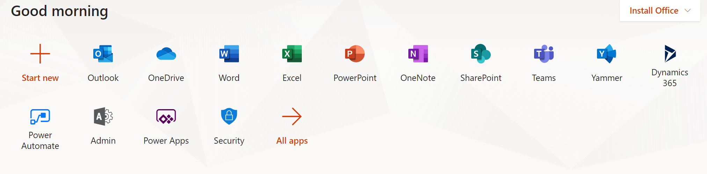
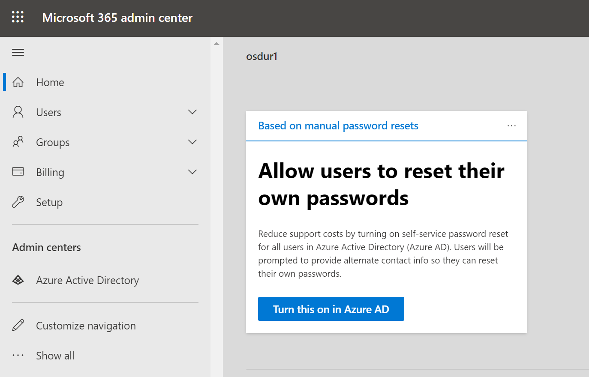

# OSDU R2 Microsoft Graph Search Connector Sample for Wells

This .NET Core application shows how to use the Microsoft Graph indexing API to
create a connection to the Microsoft Search service and index custom items. The
sample indexes TNO wells dataset exported from Open Subsurface Data Universe
(OSDU) R2.

## Prerequisites

-   .NET 3.1 SDK

-   [Entity Framework Core
    Tools](https://docs.microsoft.com/ef/core/miscellaneous/cli/dotnet) (`dotnet
    tool install --global dotnet-ef`)

# Microsoft Graph connectors preview

Microsoft Graph connectors and Microsoft Search APIs (query and index) are
currently in preview status. To gain access to connectors functionality, you
must turn on the Targeted release option in your tenant. This is an early
preview, and there's no service level guarantee. We encourage customers to try
connectors functionality and provide feedback. We don’t recommend using
connectors for production purposes during the preview period.

## Set up Targeted release

To try connectors, you must have the **Targeted release** option set for all
users in your organization. To learn more about the Targeted release option and
how to set it, see [Set up the Standard or Targeted release options in Office
365](https://docs.microsoft.com/en-us/office365/admin/manage/release-options-in-office-365?view=o365-worldwide).

## Choose a preview environment

To try connectors, indexing APIs, and search APIs, we recommend these two
methods:

1.  **Test tenant**. We encourage you to use a test tenant to try the Microsoft
    Graph connectors preview.

2.  **Test site collection**. If you don't have a test tenant, you can create a
    test site collection to try out connectors functionality. To show results
    from connectors without impacting the search pages anywhere else in your
    organization, customize the search experience of only that site collection.

For further details and limitation of the preview please see this
[link](https://docs.microsoft.com/en-us/microsoft-365/commerce/sign-up-for-office-365-trial?view=o365-worldwide).

## Register an app in Azure portal for O365

In this step you'll register an application in the Azure AD admin center for
your O365 tenant. For the demo you can create a trial O365 account
[here](https://docs.microsoft.com/en-us/microsoft-365/commerce/sign-up-for-office-365-trial?view=o365-worldwide).
This is necessary to authenticate the application to make calls to the Microsoft
Graph indexing API. Note that is you're using your corporate O365 account you
will need to talk to your administrator to create this application for you.

1.  Go to the [Azure Active Directory admin
    center](https://aad.portal.azure.com/) in your O365 account and sign in with
    an administrator account.

1.  Select **Azure Active Directory** in the left-hand pane, then select **App
    registrations** under **Manage**.

1.  Select **New registration**.

2.  Complete the **Register an application** form with the following values,
    then select **Register**.

    -   **Name:** `OSDU R2 Wells Connector`

    -   **Supported account types:** `Accounts in this organizational directory
        only (Microsoft only - Single tenant)`

    -   **Redirect URI:** Leave blank

3.  On the **OSDU R2 Wells Connector** page, copy the value of **Application
    (client) ID**, you'll need it in the next section.

4.  Copy the value of **Directory (tenant) ID**, you'll need it in the next
    section.

5.  Select **API Permissions** under **Manage**.

6.  Select **Add a permission**, then select **Microsoft Graph**.

7.  Select **Application permissions**, then select the
    **ExternalItem.ReadWrite.All** permission. Select **Add permissions**.

8.  Select **Grant admin consent for {TENANT}**, then select **Yes** when
    prompted.

9.  Select **Certificates & secrets** under **Manage**, then select **New client
    secret**.

10. Enter a description and choose an expiration time for the secret, then
    select **Add**.

11. Copy the new secret, you'll need it in the next section.

## Configure the app

1.  Open your command line interface (CLI) in the directory where
    **OSDUR2WellConnector.csproj** is located.

2.  Run the following command to initialize [user
    secrets](https://docs.microsoft.com/aspnet/core/security/app-secrets) for
    the project.

>   dotnet user-secrets init

1.  Run the following commands to store your app ID, app secret, and tenant ID
    in the user secret store.

>   dotnet user-secrets set appId "YOUR_APP_ID_HERE"  
>   dotnet user-secrets set appSecret "YOUR_APP_SECRET_HERE"  
>   dotnet user-secrets set tenantId "YOUR_TENANT_ID_HERE"

## Initialize the database

>   dotnet ef migrations add InitialCreate  
>   dotnet ef database update

## Delete and reset database

>   dotnet ef database drop  
>   dotnet ef database update

## Run the Graph Connector app to create the O365 Assets

In this step you'll build and run the sample. This will create a new connection,
register the schema, then push items from the [WellData.csv](ApplianceParts.csv)
file into the connection.

1.  Open your command-line interface (CLI) in the **OSDUR2WellConnector**
    directory.

2.  Use the `dotnet build` command to build the sample.

3.  Use the `dotnet run` command to run the sample.

4.  Select the **1. Create a connection** option. Enter a unique identifier,
    name, and description for the connection.

5.  Select the **4. Register schema for current connection** option. Wait for
    the operation to complete.

-   **Note:** If this steps results in an error, wait a few minutes and then
    select the **5. View schema for current connection** option. If a schema is
    returned, the operation completed successfully. If no schema is returned,
    you may need to try registering the schema again.

1.  Select the **6. Push updated items to current connection** option.

## Create a vertical

Create and enable a search vertical at the organization level following the
instructions in [Customize the Microsoft Search
page](https://docs.microsoft.com/MicrosoftSearch/customize-search-page).

-   **Name:** Appliance Parts

-   **Content source:** the connector created with the app

-   **Add a query:** leave blank

## Create a result type

Create a result type at the organization level following the instructions in
[Customize the Microsoft Search
page](https://docs.microsoft.com/MicrosoftSearch/customize-search-page).

-   **Name:** Appliance Part

-   **Content source:** the connector created with the app

-   **Rules:** None

-   Paste contents of [result-type.json](result-type.json) into layout

## Search for results

In this step you'll search for parts in SharePoint.

1.  Go to your root SharePoint site for your tenant.

2.  Using the search box at the top of the page, search for `hinge`.

3.  When the search completes with 0 results, select the **Appliance Parts**
    tab.

4.  Results from the connector are displayed.

## Updating records in the database

Use your favorite tool to update records in the database. The **Push updated
items** menu choice will only push the items you update.

>   **NOTE:** Do not delete records from the database. To "delete" an item, set
>   the IsDeleted property to 1.

>   DB Browser
